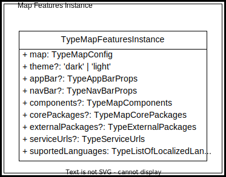

- [The Map Features Instance](./README.md#the-map-features-instance)
  - [Map](./README.md#map)
  - [Theme](./README.md#theme)
  - [AppBar](./README.md#appbar)
  - [NavBar](./README.md#navbar)
  - [Components](./README.md#components)
  - [CorePackages](./README.md#corepackages)
  - [ExternalPackages](./README.md#externalpackages)
  - [ServiceUrls](./README.md#serviceurls)
- [The Map Configuration](./README.md#the-map-configuration)
  - [The nesting levels](./README.md#the-nesting-levels)
  - [Base Layer Entry Config Chaining](./README.md#base-layer-entry-config-chaining)
  - [The notion of layer path](./README.md#the-notion-of-layer-path)

# The Map Features Instance

The global configuration of the maps we want to display is kept internally in the properties of a javascript object whose type is defined by the TypeMapFeaturesInstance. The value of these properties is passed to the viewer using JSON streams that can come from an HTML div, an application code segment, a GeoCore entry, a URL, or a JSON file. The structure of the configuration consists of several sections nested within each other. Each section is associated with a data type and one of these types is recursive. Within the configuration, some mandatory parameters are defined as optional in the validation schema, because their value can be deduced from the information provided by other parameters. It is the validation algorithm that will ensure these parameters are properly initialized. by doing so, we reduce the size of the map configuration.

At its highest level, the configuration allows to define not only the map to be displayed, but also the content of the appBar, the components, the corePackages and externalPackages, the serviceUrls, the supported languages and the version of the configuration schema used.

&nbsp;

  

## map

The `map` property is mandatory and its type is `TypeMapConfig`. It is here we describe the layers that will be displayed on the map. Its structure is pretty complexe and will be covered in a dedicated section.

## theme

The `theme` property is optional and its value can be `'dark'` or `'light'`. When its value is undefined, the `'dark'` theme is used by default.

## appBar

The `appBar` property is optional and its type is `TypeAppBarProps`. It is used to define the controls available on the application bar. When its value is undefined, the default `['geolocator']` will be used.

## navBar

The `navBar` property is optional and its type is `TypeNavBarProps`. It is used to define the controls available on the navigation bar. When its value is undefined, the default `['zoom' | 'fullscreen' | 'home']` will be used.

## components

The `components` property is optional and its type is `TypeMapComponents` which is an array whose value domain is `'north-arrow', 'overview-map'`.

## corePackages

The `corePackages` property is optional and its type is `TypeMapCorePackages` which is an array whose value domain is `'basemap-panel', 'layers-panel', 'details-panel', 'geolocator-panel', 'footer-panel'`. It is used to define the core packages to initialize when the viewer is loaded. The schema for these packages and their default configuration are on their own package. When its value is undefined, the default = ['basemap-panel' | 'layers-panel' | 'details-panel' | 'geolocator-panel'] is used.

## externalPackages

The `externalPackages` property is optional and its type is `TypeExternalPackages` which is an array of records having as properties `name` (the external package name) and `configUrl` (its configuration URL). The listed packages will be initialized when the viewer is loaded. When its value is undefined, the default = [] is used.

## serviceUrls

NOTE: This property is not used in the current implementation. It is documented here as a wish.
The `serviceUrls` property is optional and its type is `TypeExternalPackages` which is a records having as properties `keys` and `proxyUrl`. `keys` refer to the service end point to access API for layers specification (loading and plugins parameters). By default it is GeoCore but can be another endpoint with similar output.

## suportedLanguages

The `suportedLanguages` property is mandatory and its type is `TypeListOfLocalizedLanguages` which is an array of 0..2 elements whose value can be `'en'` or `'fr'`. When a language is selected here, all `TypeLocalizedString` properties of the configuration must initialize the corresponding property. When `suportedLanguages` specify only one language, the validation process will copy the property of the supported language in the property of the other language for all the `TypeLocalizedString` properties of the configuration. This allow to reduce the size of the configuration.

# The Map Configuration

The map configuration section is used to define the elements we want to appear on the map. Here, we define the base map to use and its options, the kind of interaction, the list of GeoView layer configurations, the view settings and extraOptions. The following figure shows a deeper but not complete representation of the configuration.

&nbsp;

  

## The nesting levels

The first nesting level is the **map features**. As we have seen above, it defines the environment in which the map will reside. The next level is the **map configuration** which contains the map's definitions and basic settings. The **map configuration** has a `listOfGeoviewLayerConfig` property, which is an array of `TypeGeoviewLayerConfig` objects . Thus, the next nesting level is the **GeoView Layer Config**. A GeoView layer is composed of one to many layers of the same type. The list of these layers is stored in the `listOfLayerEntryConfig` property of the **GeoView Layer Config**. Again we say list, but in fact it is an array of `TypeLayerEntryConfig` objects. The **Layer Entry Config** is our
next and final level of nesting. Its data type is polymorphic. It can therefore host any child of its base class `TypeBaseLayerEntryConfig` and has access to all common properties of its children. One of these children whose type is `TypeLayerGroupEntryConfig` allows to define layer groups. This type has a recursive behavior. It is therefore possible to place a layer group in another group. This ability is illustrated by the composition relationship between the `TypeLayerGroupEntryConfig` and the `TypeBaseLayerEntryConfig` which in turn can instantiate a `TypeLayerGroupEntryConfig`. Figure [Layer Grouping and Entry Config Chaining](./README.md#layerGroupingAndEntryConfigChaining) shows the nesting and chaining in an easier to understand visual way. It shows a Geoview layer composed of two vector layers and a group which in turn is composed of one vector layer and another group composed of three vector layers. The resulting structure is similar to a tree. Some rules apply:

- all leaves must be a displayable layer and not a group;
- all leaves must have a type compatible with the `geoviewLayerType`;
- all nodes between the GeoView root layer and a leaf are groups.

&nbsp;

  

## Base Layer Entry Config Chaining

All nodes at the lowest nesting level are linked to their parent node by the `parentLayerConfig` property and to their Geoview root node by the `geoviewRootLayer` property. When both properties are equal, we know we are at the root of the tree. The chaining of layer entries is illustrated by the dotted lines in the figure [MapConfiguration](./README.md#TypeMapConfig). The red dotted line emphasizes that recursive groups are chained with their parent group nodes until the root of the tree is reached. The chaining of configuration nodes is more easily seen in the following figure.

&nbsp;

  

## The notion of layer path

The layer path is the internal identifier of a layer displayed on a map. The GeoView viewer can place multiple maps on a page and each of these maps can display various types of layers from different servers. We will see later how to link a layer served by an access point to the viewer. Let's just say for now that the link to the layer coming from the server is only done using the `layerId`.

For now, we will concentrate on the Layer path. This is the path that we need to follow from the root of the tree shown above in figure [Layer Grouping and Entry Config Chaining](./README.md#layerGroupingAndEntryConfigChaining) to get to the layer we are interested in. The syntax used is a string of values separated by forward slashes and where the nodes are the value of the identifiers of the path followed. So, for example, the layer path that identifies the **_icons configuration_** in the tree shown in the [figure above](./README.md#layerGroupingAndEntryConfigChaining) is:
**_
My_map_layer/Points/Icons.
_**

It is thanks to this identifier that we can unambiguously identify this layer when we code.

Layer paths can only be used once. However, it sometimes happens that we want to place the same layer from the same server twice on the same display level in the viewer, because some servers differentiate the data with styles. This is the case with WMS sometimes. But in this case, how can we achieve this since the link is only made with the `layerId`? We would have to repeat the same path twice.

To do this, the viewer uses an additional field named `layerPathEnding` to be able to place the layer again on the same display level. In this case, the syntax of the layer path is a bit different. In figure [Layer Grouping and Entry Config Chaining](./README.md#layerGroupingAndEntryConfigChaining) there are two layers on the lowest level that exploit this capability. Let's take the layer path to get to the bottom left configuration. Its value is:
**_
My_map_layer/Points/Symbols/Squares.Style1.
_**

The `layerPathEnding` does not participate in the connection to the server. Only the `layerId` does. And it is not a node in the tree either. So we can't use a forward slash as a separator. We differentiate it with a dot as a separator.
