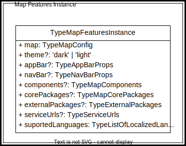

- [The Map Features Instance](./README.md#the-map-features-instance)
    - [Map](./README.md#map)
    - [Theme](./README.md#theme)
    - [AppBar](./README.md#appbar)
    - [NavBar](./README.md#navbar)
    - [Components](./README.md#components)
    - [CorePackages](./README.md#corepackages)
    - [ExternalPackages](./README.md#externalpackages)
    - [ServiceUrls](./README.md#serviceurls)
- [The Map Configuration](./README.md#the-map-configuration)
    - [The nesting levels](./README.md#the-nesting-levels)
    - [Layer Grouping](./README.md#layer-grouping)
    - [Base Layer Entry Config Chaining](./README.md#base-layer-entry-config-chaining)

# The Map Features Instance

The global configuration of the maps we want to display is kept internally in the properties of a javascript object whose type is defined by the TypeMapFeaturesInstance.  The value of these properties is passed to the viewer using JSON streams that can come from an HTML div, an application code segment, a GeoCore entry, a URL, or a JSON file. The structure of the configuration consists of several sections nested within each other. Each section is associated with a data type and one of these types is recursive. Within the configuration, some mandatory parameters are defined as optional in the validation schema, because their value can be deduced from the information provided by other parameters. It is the validation algorithm that will ensure these parameters are properly initialized. by doing so, we reduce the size of the map configuration.

At its highest level, the configuration allows to define not only the map to be displayed, but also the content of the appBar, the components, the corePackages and externalPackages, the serviceUrls, the supported languages and the version of the configuration schema used.

&nbsp;

  

## map

The `map` property is mandatory and its type is `TypeMapConfig`. It is here we describe the layers that will be displayed on the map. Its structure is pretty complexe and will be covered in a dedicated section.

## theme

The `theme` property is optional and its value can be `'dark'` or `'light'`. When its value is undefined, the `'dark'` theme is used by default.

## appBar

The `appBar` property is optional and its type is `TypeAppBarProps`. It contains a localized `about` string providing an English/French description in Markdown format. When undefined, it is ignored. If not, it will create a button on the app-bar to open the panel. In the basic view, this information may be added in a container above the map.

## navBar

The `navBar` property is optional and its type is `TypeNavBarProps`. It is used to define the controls available on the navigation bar. When its value is undefined, the default `['zoom' | 'fullscreen' | 'fullextent']` will be used.

## components

The `components` property is optional and its type is `TypeMapComponents` which is an array whose value domain is `'app-bar', 'footer-bar', 'nav-bar', 'north-arrow', 'overview-map'`.

## corePackages

The `corePackages` property is optional and its type is `TypeMapCorePackages` which is an array whose value domain is `'basemap-panel', 'layers-panel', 'details-panel', 'geolocator-panel', 'footer-panel'`. It is used to define the core packages to initialize when the viewer is loaded. The schema for these packages and their default configuration are on their own package. When its value is undefined, the default = ['basemap-panel' | 'layers-panel' | 'details-panel' | 'geolocator-panel'] is used.

## externalPackages

The `externalPackages` property is optional and its type is `TypeExternalPackages` which is an array of records having as properties `name` (the external package name) and `configUrl` (its configuration URL). The listed packages will be initialized when the viewer is loaded. When its value is undefined, the default = [] is used.

## serviceUrls

NOTE: This property is not used in the current implementation. It is documented here as a wish.
The `serviceUrls` property is optional and its type is `TypeExternalPackages` which is a records having as properties `keys` and `proxyUrl`. `keys` refer to the service end point to access API for layers specification (loading and plugins parameters). By default it is GeoCore but can be another endpoint with similar output.

## suportedLanguages

The `suportedLanguages` property is mandatory and its type is `TypeListOfLocalizedLanguages` which is an array of 0..2 elements whose value can be `'en'` or `'fr'`. When a language is selected here, all `TypeLocalizedString` properties of the configuration must initialize the corresponding property. When `suportedLanguages` specify only one language, the validation process will copy the property of the supported language in the property of the other language for all the `TypeLocalizedString` properties of the configuration. This allow to reduce the size of the configuration.

# The Map Configuration

The map configuration section is used to define the elements we want to appear on the map. Here, we define the base map to use and its options, the kind of interaction, the list of GeoView layer configurations, the view settings and extraOptions. The following figure shows a deeper but not complete representation of the configuration.

&nbsp;

  

## The nesting levels

The first nesting level is the **map features**. As we have seen above, it defines the environment in which the map will reside. The next level is the **map configuration** which contains the map's definitions and basic settings. The **map configuration** has a `listOfGeoviewLayerConfig` property, which is an array of `TypeGeoviewLayerConfig` objects . Thus, the next nesting level is the **GeoView Layer Config**. A GeoView layer is composed of one to many layers of the same type. The list of these layers is stored in the `listOfLayerEntryConfig` property of the **GeoView Layer Config**. Again we say list, but in fact it is an array of `TypeLayerEntryConfig` objects. The **Layer Entry Config**  is our next and lat nesting level. The `TypeLayerEntryConfig` is a polymorphic type. Its base type is `TypeBaseLayerEntryConfig` abd it owns all the common properties of its children.

&nbsp;

  

## Layer Grouping

GeoView layers allow you to create layer groups and these groups can contain group nodes or layer nodes. This means that we can create a hierarchical structure of layers that looks like a tree. It is important to remember that this structure must respect the constraint that all leaves of the tree must be a displayable layer and not a group. The layer grouping can be deduced from the cardinality of the composition relations in figure [MapConfiguration](./README.md#TypeMapConfig).

## Base Layer Entry Config Chaining

All nodes at the lowest nesting level are linked to their parent node by the `parentLayerConfig` property and to their Geoview root node by the `geoviewRootLayer` property. When both properties are equal, we know we are at the root of the tree. The layer entry chaining is illustrated by the doted lines in figure [MapConfiguration](./README.md#TypeMapConfig).